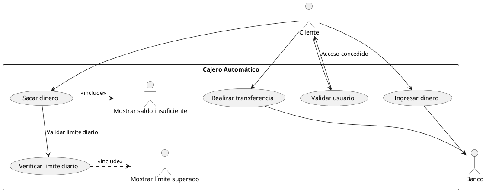

# Diagrama de Cajero

## Trabajo a realizar

### Diagrama de Casos de Uso  

### Caso de Uso: Validar Usuario

#### Flujo Normal
1. El cliente inserta su tarjeta y el PIN en el cajero automático.  
2. El sistema verifica la autenticidad de la tarjeta y la validez del PIN.  
3. Si la información es correcta, el sistema permite el acceso del cliente al cajero automático.  
4. Se muestra el menú principal con las opciones disponibles. 

#### Flujo en caso de **ERROR**
- **PIN incorrecto:** Si el PIN ingresado es incorrecto, el sistema muestra un mensaje de error y solicita al cliente volver a intentarlo. Después de varios intentos fallidos, el sistema bloquea la tarjeta por seguridad.  
- **Tarjeta inválida:** Si el sistema no puede leer la tarjeta o es inválida, muestra un mensaje de error y solicita que se intente con otra tarjeta.  

### Caso de Uso: Verificar Límite Diario

#### Flujo Normal
1. El cliente selecciona la opción de **"Sacar dinero"**.  
2. El sistema solicita que ingrese el monto a retirar.  
3. El sistema verifica si la cantidad solicitada está dentro del límite diario permitido por la cuenta del cliente.  
4. Si la transacción está dentro del límite, el sistema permite continuar con la operación.  

#### Flujo en caso de **ERROR**
- **Límite diario excedido:** Si el monto solicitado supera el límite diario permitido, el sistema muestra un mensaje de advertencia y solicita al cliente que ingrese una cantidad menor.  

### Caso de Uso: Realizar Transferencia

#### Flujo Normal
1. El cliente selecciona la opción **"Realizar transferencia"**.  
2. El sistema solicita al cliente ingresar los datos del beneficiario.
3. El sistema verifica que la cuenta del beneficiario sea válida y que el cliente tenga suficiente saldo para realizar la transferencia.  
4. Si todo es correcto, el sistema procesa la transferencia y muestra un mensaje de confirmación.  

#### Flujo en caso de **ERROR**
- **Saldo insuficiente:** Si el cliente no tiene suficiente saldo para realizar la transferencia, el sistema muestra un mensaje de error y no procesa la operación.  
- **Cuenta beneficiario inválida:** Si la cuenta del beneficiario no es válida, el sistema muestra un mensaje de error y solicita al cliente verificar los datos.  

### Caso de Uso: Ingresar Dinero

#### Flujo Normal
1. El cliente selecciona la opción **"Ingresar dinero"**.  
2. El sistema solicita que el cliente inserte el dinero en el cajero automático.  
3. El sistema verifica que el dinero insertado sea válido y lo suma al saldo de la cuenta del cliente.  
4. Una vez que se ha ingresado correctamente el dinero, el sistema muestra un mensaje de confirmación y actualiza el saldo de la cuenta.  

#### Flujo en caso de **ERROR**
- **Dinero no válido:** Si el cajero detecta que el dinero insertado no es válido (por ejemplo, billetes rotos o falsificados), el sistema muestra un mensaje de error y solicita que se inserte dinero válido.  
- **Problema de validación:** Si el sistema no puede validar correctamente el dinero (por problemas técnicos), muestra un mensaje de error y solicita al cliente que intente nuevamente.  

### Caso de Uso: Sacar Dinero

#### Flujo Normal
1. El cliente se autentica en el sistema ingresando su tarjeta y PIN.  
2. El sistema valida la información y permite el acceso.  
3. El cliente selecciona la opción de **"Sacar dinero"**.  
4. El sistema solicita al cliente ingresar el monto a retirar.  
5. El sistema verifica si el cliente tiene saldo suficiente.  
6. El sistema valida que la cantidad solicitada no supere el límite diario.  
7. Si las validaciones son exitosas, el cajero entrega el dinero y actualiza el saldo.  
8. Se muestra un mensaje confirmando la transacción y se pregunta si el cliente desea otra operación.  

#### Flujo en caso de **ERROR**
- **Saldo insuficiente:** Si el cliente no tiene saldo suficiente, el sistema muestra un mensaje de error y solicita otra cantidad.  
- **Límite diario excedido:** Si la cantidad supera el límite permitido, el sistema muestra una advertencia y solicita otro monto.  
- **Error de conexión:** Si el sistema no puede completar la transacción, se muestra un mensaje de error y se cancela la operación.

### ¿Para qué sirve un diagrama de casos de uso?

Realizar un diagrama de casos de uso para el sistema de un cajero automático permite visualizar cómo interactúan los clientes con el sistema y qué funcionalidades están disponibles, como retirar dinero, realizar transferencias o ingresar dinero.

Este modelo ayuda a anticipar escenarios como **saldo insuficiente** o **límite diario excedido**, permitiendo definir reglas de negocio claras y mejorar la experiencia del usuario. Además, facilita la **comunicación entre analistas, desarrolladores y clientes**, asegurando que el sistema esté bien estructurado antes de su implementación, reduciendo errores y optimizando su desarrollo.

